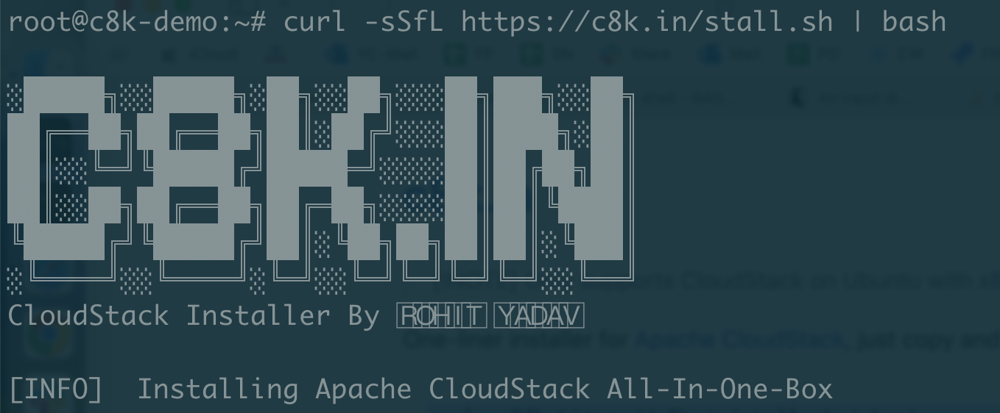

# [c8k.in](https://github.com/cloudstack/c8k.in): One-liner installer for [Apache CloudStack](https://cloudstack.apache.org)

> [!NOTE]
> Only supports CloudStack installation on Ubuntu with x86_64 KVM and tested with Ubuntu 22.04 LTS (x86_64). Please use this on a throwaway host or a VM (with hardware acceleration) that wouldn't hurt you to lose, in an [RFC1918 local private network](https://en.wikipedia.org/wiki/Private_network). This is currently in `beta` and open for users testing and issue reporting.


To install and deploy [CloudStack](https://cloudstack.apache.org), just copy and run the following as `root` user:

```bash
curl -sL https://c8k.in/stall.sh | bash
```

Here's how you should really run it though:

```bash
curl -o install.sh https://c8k.in/stall.sh
cat install.sh | more # to read it
bash -x install.sh # to also see what it's doing
```

> [!IMPORTANT]
> This deploys an all-in-a-box CloudStack installation that has the CloudStack management & usage server, CloudStack agent, MySQL DB, NFS and KVM on a single Linux host and is only useful for anyone who just wants to try CloudStack on a host or a VM, but does not want to [read the official docs](https://docs.cloudstack.apache.org). It makes several assumptions about the IaaS deployment, and tries to figure out host's network setup so the deployment could work out of the box. This is not advised for production deployment.

Screenshot after running the command:



Screenshot when the command finishes:


Created by [@rohityadavcloud](https://github.com/rohityadavcloud) as part of a hackathon.

[Discuss further here](https://github.com/apache/cloudstack/discussions)

Get Source or Report an issue: [https://github.com/rohityadavcloud/c8k.in](https://github.com/rohityadavcloud/c8k.in)
